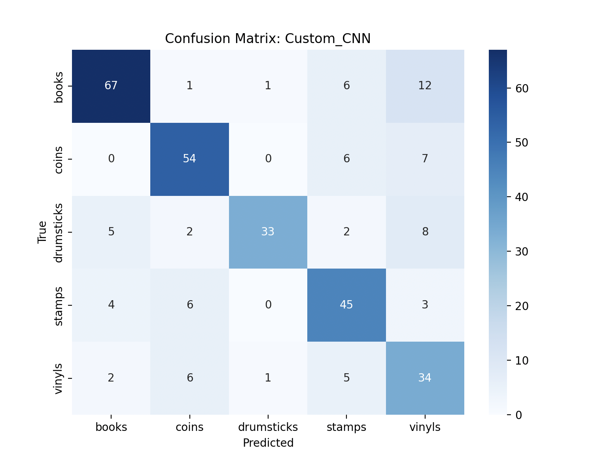
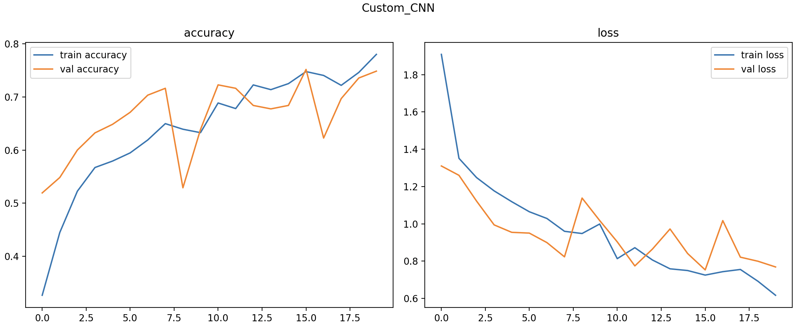
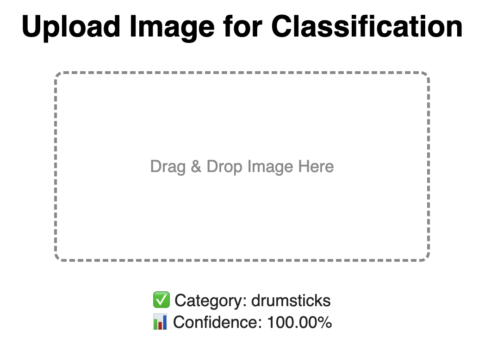

# 🧠 Classifier for Collectibles

Цей проєкт — вебзастосунок для класифікації зображень колекційних предметів за допомогою згорткової нейромережі (CNN).

## 🧩 Класи
- `books`
- `coins`
- `drumsticks`
- `stamps`
- `vinyls`

## 📚 Джерела даних

Для тренування моделі використовувалися комбіновані дані з таких джерел:

- 📦 [Book Covers Dataset (Kaggle)](https://www.kaggle.com/datasets/lukaanicin/book-covers-dataset)
- 📦 [Coin Image Dataset (Kaggle)](https://www.kaggle.com/datasets/mexwell/coin-image-dataset)
- 🌐 Зображення з Google Images та eBay (завантажені скриптом `image_collector`)
- 📸 Власні фотографії з приватної колекції

## 🧱 Архітектура моделі

Модель побудована вручну на базі згорткової нейронної мережі (CNN):

- `3 × Conv2D + MaxPooling2D` — виділення локальних рис зображень
- `Flatten` — перетворення вектора ознак у плоский вигляд
- `Dense(256) + Dropout(0.5)` — повнозв'язаний шар для узагальнення + регуляризація
- `Dense(5, activation='softmax')` — вихідний шар для класифікації на 5 класів

```python
model = Sequential([
    Conv2D(32, (3, 3), activation='relu'),
    MaxPooling2D(),
    Conv2D(64, (3, 3), activation='relu'),
    MaxPooling2D(),
    Conv2D(128, (3, 3), activation='relu'),
    MaxPooling2D(),
    Flatten(),
    Dense(256, activation='relu'),
    Dropout(0.5),
    Dense(5, activation='softmax')
])
```

## 🧪 Історія експериментів

На початку ми протестували кілька відомих моделей:

- ✅ **Custom CNN** показала найкращу стабільність і баланс точності.
- ❌ **EfficientNetB0** видавала `nan` втрати і майже не вчилась.
- ❌ **ResNet50** та **MobileNetV2** давали відчутний overfitting — тренувальна точність була висока, але на валідації результат деградував.

Ми експериментували з:
- `categorical` vs `sparse` loss функціями
- `OneHot` vs `integer labels`
- використанням `class_weight`
- різними видами аугментацій
- зміною кількості класів
- підбором гіперпараметрів

## ⚙️ Характеристики тренування

- 📐 Розмір зображення: `224×224`
- 🔄 Аугментація: повороти, зсув, зум, фліп
- ⚖️ Балансування класів: `class_weight`
- 📊 Стратифікований train/test спліт: `80/20`
- 🧠 Optimizer: `Adam`
- ⏱ Epochs: `20`

## 📈 Результати

- **Final Accuracy:** `75%`
- **Precision (macro avg):** `0.76`
- **Recall (macro avg):** `0.74`
- **F1-score (macro avg):** `0.75`

| Class        | Precision | Recall | F1-score |
|--------------|-----------|--------|----------|
| books        | 0.86      | 0.77   | 0.81     |
| coins        | 0.78      | 0.81   | 0.79     |
| drumsticks   | 0.94      | 0.66   | 0.78     |
| stamps       | 0.70      | 0.78   | 0.74     |
| vinyls       | 0.53      | 0.71   | 0.61     |

## 📌 Аналіз якості

Модель демонструє найвищу якість класифікації для класів `books`, `coins`, і `drumsticks`:

- 📘 **books** — має найвищий F1-score (0.81), тобто модель дуже добре виявляє книги і рідко їх плутає з іншими класами.
- 🪙 **coins** — модель добре виявляє монети (Recall 0.81), проте Precision трохи нижчий (0.78), тобто є невелика кількість помилкових позитивних результатів.
- 🥁 **drumsticks** — найбільша Precision (0.94), тобто якщо модель класифікує зображення як барабанні палички — це майже завжди правильно. Проте Recall трохи нижчий (0.66), що означає, що модель іноді пропускає справжні приклади drumsticks.

Для інших класів:

- ✉️ **stamps** — має збалансовані показники Precision (0.70) і Recall (0.78), що свідчить про загалом хорошу класифікацію.
- 💿 **vinyls** — найменш стабільний клас. Recall (0.71) свідчить, що модель часто знаходить вініли, але низька Precision (0.53) вказує на те, що часто помилково відносить до цієї категорії інші об'єкти (наприклад, книги чи монети).

## 📊 Графіки

### 📌 Confusion Matrix


### 📌 Accuracy / Loss


#### Графік "accuracy" (зліва):
- **Синя лінія (`train accuracy`)** — точність на тренувальній вибірці.
- **Помаранчева лінія (`val accuracy`)** — точність на валідаційній вибірці.
- Модель **стабільно покращує** точність на тренуванні.
- Точність на валідації **йде вгору разом із тренувальною**, що є **хорошим знаком** — модель **не перенавчається**.
- Є деякі **провали** (епохи 8, 14), але **загальна тенденція зростаюча** — **модель вчиться**.

#### 📉 Графік "loss" (справа)
- **Синя лінія (`train loss`)** — значення функції втрат на тренувальних даних.
- **Помаранчева лінія (`val loss`)** — втрати на валідаційних.
- Обидві криві **падають**, що означає **зменшення помилок** — це добре.
- Є кілька **сплесків втрат на валідації** (епохи ~8, ~14), але вони швидко згладжуються.

## 🌐 Веб-інтерфейс

- Побудований на Flask
- Drag & Drop підтримка (JS + CSS)
- Виводить:
  - Категорію
  - Впевненість


## 📦 Встановлення

```bash
poetry install
poetry shell
pip install tensorflow-macos tensorflow-metal
python app.py
```

## 🗂 Структура

```
.
├── app.py                          # Flask API для завантаження фото
├── utils.py                        # Функції: класифікація, OCR
├── best_custom_cnn.keras           # Збережена модель
├── README.md                       # Документація
├── pyproject.toml                  # Poetry конфігурація
├── poetry.lock                     # Залежності (генерується)
├── .gitignore                      # Ігнорує тимчасові/непотрібні файли
│
├── accuracy_loss.png               # Графік точності та втрат
├── confusion_matrix.png            # Матриця плутанини
│
├── static/                         # Статичні файли (JS/CSS)
│   ├── styles.css
│   └── script.js
│
├── templates/                      # HTML шаблони Flask
│   └── index.html
│
├── test/                           # Тестові зображення
│   ├── Coin.jpg
│   ├── Drumstick.jpg
│   ├── Stamp.jpg
│   └── Vinyl.jpg
│
├── train_model/                    # Навчання моделі
│   ├── train_model_cnn.py
│   └── dataset.zip                 # Dataset
│
└── image_collector/                # Збір зображень з інтернету
    ├── image_collector_ebay.py
    └── image_collector_google.py
```
